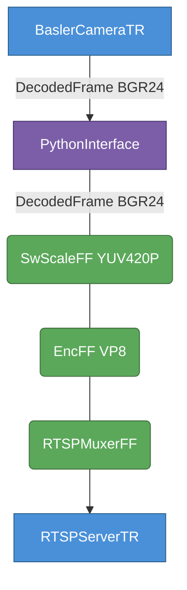

# Basler Camera Python Apps

Demo apps for live acquisition from Basler cameras using the limef Basler plugin.

> [!IMPORTANT]
> Only one process can hold the camera open at a time.  Close Pylon Viewer (or
> `basler_configure.py`) before starting any of these scripts.

## Setup

Source the development environment and make sure the plugin is built and staged:

```bash
source ~/limef/go_debug.bash   # sets LD_LIBRARY_PATH and PYTHONPATH
```

## Camera configuration

Before running any script, configure the camera once and save the settings to a
`.pfs` feature file.  The thread loads it automatically on startup.

**Pylon Viewer (GUI, recommended):**

```bash
/opt/pylon/bin/pylonviewer
```

Adjust focus distance, aperture, exposure, gain, etc. while watching the live
image, then **Features → Save Features…** → e.g. `camera.pfs`.

**basler_configure.py (CLI / scriptable):**

```bash
python3 basler_configure.py                       # interactive shell + saves camera.pfs
python3 basler_configure.py --get ExposureTime    # read one parameter
python3 basler_configure.py --dump                # print all parameters
python3 basler_configure.py --set "ExposureAuto=Continuous" --save camera.pfs
```

---

## basler_pipeline.py

*Minimal grab demo — print frame info to the terminal*

```bash
python3 basler_pipeline.py [--feature-file camera.pfs] [--secs 10] [--mono]
```

### Pipeline


`BaslerCameraTR` includes an internal `SwScaleFF` that converts the raw camera
format (`Mono8` or `YUYV422`) to the requested `output_format` (`GRAY8` in
`--mono` mode, `NV12` otherwise).

---

## basler_dump.py

*Grab N frames and save each as a PNG file*

```bash
python3 basler_dump.py [--feature-file camera.pfs] [--frames 5] [--fps 1] [--mono] [--outdir frames/]
```

Writes `frame000001.png`, `frame000002.png`, … into the output directory.

### Pipeline


`WritePNGFF` converts any CPU pixel format to RGB24 via libswscale before PNG
encoding, so both `GRAY8` and `NV12` inputs produce correct grayscale PNGs.
Frames are also forwarded downstream unchanged (pass-through), so a
`DumpFrameFilter` can be chained after it for debugging.

---

## basler_rtsp.py

*Grab live frames, process in Python (Gaussian blur), stream as RTSP VP8*

```bash
python3 basler_rtsp.py [--feature-file camera.pfs] [--port 8554] [--fps 30] [--bitrate 2000000]
```

Connect with:

```bash
ffplay rtsp://localhost:8554/live/stream
ffplay -rtsp_transport tcp rtsp://localhost:8554/live/stream
```

### Pipeline



`PythonInterface` acts as a thread boundary.  The Python consumer thread pulls
`DecodedFrame BGR24`, applies a Gaussian blur via OpenCV, and pushes the result
back downstream.  `StreamFrame`s are forwarded unchanged.  The interface is
created with `leaky=True` so the camera grab loop never stalls if Python falls
behind.

### Live parameter control

While the stream is running, type `KEY VALUE` into the terminal to adjust any
GenICam parameter on the fly:

```
ExposureTime 20000        # set exposure to 20 ms (manual)
ExposureAuto Off          # disable auto-exposure
ExposureAuto Continuous   # re-enable auto-exposure
Gain 5.0                  # set gain manually
GainAuto Off              # disable auto-gain  (must do this before setting Gain)
GainAuto Continuous       # re-enable auto-gain
FocusDistance 0.8         # focus at ~80 cm
quit                      # stop the stream
```

> **Note:** GenICam enum values are case-sensitive — `Off`, `Once`,
> `Continuous` (not `off`, `on`, `continuous`).  There is no `On`; the
> opposite of `Off` for auto features is `Continuous`.  To disable auto before
> setting a manual value, send the `Off` command first.

### Options

| Option | Default | Description |
|--------|---------|-------------|
| `--feature-file PATH` | — | Pylon `.pfs` file (focus, aperture, exposure, …) |
| `--serial SN` | first available | Camera serial number |
| `--width / --height` | camera default | Capture resolution |
| `--fps` | 30 | Frame rate |
| `--mono` | off | Mono8 mode (`GRAY8` instead of `BGR24`) |
| `--port` | 8554 | RTSP server port |
| `--bitrate` | 2 000 000 | VP8 encoder target bitrate (bits/sec) |
| `--secs` | 0 | Stop after N seconds (0 = run until Ctrl-C) |
| `--no-auto-exposure` | off | Disable `ExposureAuto` (use camera/feature-file setting) |
